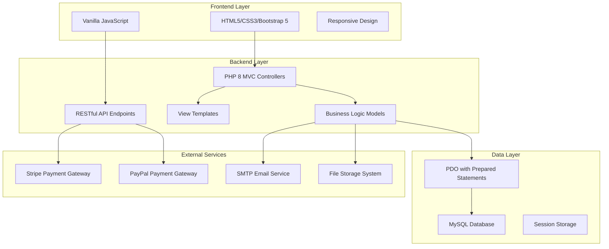

# Design Document: Ceylon Cinnamon E-commerce Website

## Overview

This design outlines a production-ready e-commerce website for Ceylon cinnamon products built with a traditional LAMP/XAMPP stack. The system follows MVC architecture patterns with PHP 8, MySQL database, and a responsive frontend using HTML5, CSS3, Bootstrap 5, and vanilla JavaScript. The design prioritizes security, performance, and maintainability while supporting both Sri Lankan and international customers.

## Architecture

### System Architecture



### MVC Structure

The application follows a clean MVC pattern:

- **Models**: Handle data operations, business logic, and database interactions
- **Views**: Render HTML templates with data from controllers
- **Controllers**: Process HTTP requests, coordinate between models and views
- **API Controllers**: Handle AJAX requests and return JSON responses

### Directory Structure

```
ceylon-cinnamon-ecommerce/
├── config/
│   ├── database.php
│   ├── config.php
│   └── .env
├── controllers/
│   ├── HomeController.php
│   ├── ProductController.php
│   ├── AuthController.php
│   ├── CartController.php
│   ├── OrderController.php
│   └── admin/
│       ├── AdminController.php
│       ├── ProductAdminController.php
│       └── OrderAdminController.php
├── models/
│   ├── User.php
│   ├── Product.php
│   ├── Category.php
│   ├── Order.php
│   ├── Cart.php
│   └── Database.php
├── views/
│   ├── layouts/
│   │   ├── header.php
│   │   ├── footer.php
│   │   └── admin_layout.php
│   ├── pages/
│   │   ├── home.php
│   │   ├── products.php
│   │   ├── product_detail.php
│   │   ├── cart.php
│   │   └── checkout.php
│   └── admin/
│       ├── dashboard.php
│       ├── products.php
│       └── orders.php
├── public/
│   ├── index.php
│   ├── api/
│   ├── assets/
│   │   ├── css/
│   │   ├── js/
│   │   └── images/
│   └── uploads/
├── includes/
│   ├── functions.php
│   ├── security.php
│   └── validation.php
├── sql/
│   ├── schema.sql
│   └── seed_data.sql
└── README.md
```

## Components and Interfaces

### Database Schema

#### Core Tables

**users**
```sql
CREATE TABLE users (
    id INT PRIMARY KEY AUTO_INCREMENT,
    email VARCHAR(255) UNIQUE NOT NULL,
    password_hash VARCHAR(255) NOT NULL,
    first_name VARCHAR(100) NOT NULL,
    last_name VARCHAR(100) NOT NULL,
    phone VARCHAR(20),
    role ENUM('customer', 'admin', 'content_manager') DEFAULT 'customer',
    is_active BOOLEAN DEFAULT TRUE,
    created_at TIMESTAMP DEFAULT CURRENT_TIMESTAMP,
    updated_at TIMESTAMP DEFAULT CURRENT_TIMESTAMP ON UPDATE CURRENT_TIMESTAMP
);
```

**categories**
```sql
CREATE TABLE categories (
    id INT PRIMARY KEY AUTO_INCREMENT,
    name VARCHAR(100) NOT NULL,
    slug VARCHAR(100) UNIQUE NOT NULL,
    description TEXT,
    parent_id INT NULL,
    image_url VARCHAR(255),
    is_active BOOLEAN DEFAULT TRUE,
    sort_order INT DEFAULT 0,
    FOREIGN KEY (parent_id) REFERENCES categories(id) ON DELETE SET NULL
);
```

**products**
```sql
CREATE TABLE products (
    id INT PRIMARY KEY AUTO_INCREMENT,
    sku VARCHAR(50) UNIQUE NOT NULL,
    name VARCHAR(255) NOT NULL,
    slug VARCHAR(255) UNIQUE NOT NULL,
    description TEXT,
    short_description VARCHAR(500),
    price DECIMAL(10,2) NOT NULL,
    sale_price DECIMAL(10,2) NULL,
    weight DECIMAL(8,3),
    dimensions VARCHAR(50),
    stock_quantity INT DEFAULT 0,
    category_id INT NOT NULL,
    is_organic BOOLEAN DEFAULT FALSE,
    origin VARCHAR(100),
    tags TEXT,
    meta_title VARCHAR(255),
    meta_description VARCHAR(500),
    is_active BOOLEAN DEFAULT TRUE,
    created_at TIMESTAMP DEFAULT CURRENT_TIMESTAMP,
    updated_at TIMESTAMP DEFAULT CURRENT_TIMESTAMP ON UPDATE CURRENT_TIMESTAMP,
    FOREIGN KEY (category_id) REFERENCES categories(id)
);
```

**orders**
```sql
CREATE TABLE orders (
    id INT PRIMARY KEY AUTO_INCREMENT,
    order_number VARCHAR(20) UNIQUE NOT NULL,
    user_id INT NULL,
    email VARCHAR(255) NOT NULL,
    first_name VARCHAR(100) NOT NULL,
    last_name VARCHAR(100) NOT NULL,
    phone VARCHAR(20),
    shipping_address TEXT NOT NULL,
    billing_address TEXT,
    subtotal DECIMAL(10,2) NOT NULL,
    shipping_cost DECIMAL(10,2) DEFAULT 0,
    tax_amount DECIMAL(10,2) DEFAULT 0,
    total_amount DECIMAL(10,2) NOT NULL,
    payment_method ENUM('stripe', 'paypal', 'bank_transfer') NOT NULL,
    payment_status ENUM('pending', 'paid', 'failed', 'refunded') DEFAULT 'pending',
    order_status ENUM('pending', 'processing', 'shipped', 'delivered', 'cancelled', 'returned') DEFAULT 'pending',
    notes TEXT,
    created_at TIMESTAMP DEFAULT CURRENT_TIMESTAMP,
    updated_at TIMESTAMP DEFAULT CURRENT_TIMESTAMP ON UPDATE CURRENT_TIMESTAMP,
    FOREIGN KEY (user_id) REFERENCES users(id) ON DELETE SET NULL
);
```

**order_items**
```sql
CREATE TABLE order_items (
    id INT PRIMARY KEY AUTO_INCREMENT,
    order_id INT NOT NULL,
    product_id INT NOT NULL,
    quantity INT NOT NULL,
    price DECIMAL(10,2) NOT NULL,
    total DECIMAL(10,2) NOT NULL,
    FOREIGN KEY (order_id) REFERENCES orders(id) ON DELETE CASCADE,
    FOREIGN KEY (product_id) REFERENCES products(id)
);
```

### API Endpoints

#### Public API Endpoints

- `GET /api/products` - Get products with filtering and pagination
- `GET /api/products/{id}` - Get single product details
- `GET /api/categories` - Get product categories
- `POST /api/cart/add` - Add item to cart
- `GET /api/cart` - Get cart contents
- `POST /api/checkout` - Process checkout
- `GET /api/order/{orderNumber}/track` - Track order status

#### Admin API Endpoints

- `GET /api/admin/products` - Get all products for admin
- `POST /api/admin/products` - Create new product
- `PUT /api/admin/products/{id}` - Update product
- `DELETE /api/admin/products/{id}` - Delete product
- `GET /api/admin/orders` - Get all orders
- `PUT /api/admin/orders/{id}/status` - Update order status
- `POST /api/admin/products/import` - Bulk import products

### Security Components

#### Authentication System

```php
class AuthController {
    public function login($email, $password) {
        // Validate input
        // Verify password using password_verify()
        // Create secure session
        // Set secure cookies
    }
    
    public function register($userData) {
        // Validate input
        // Hash password using password_hash()
        // Create user record
        // Send welcome email
    }
}
```

#### CSRF Protection

```php
class CSRFProtection {
    public static function generateToken() {
        return bin2hex(random_bytes(32));
    }
    
    public static function validateToken($token) {
        return hash_equals($_SESSION['csrf_token'], $token);
    }
}
```

#### Input Validation

```php
class Validator {
    public static function sanitizeInput($input) {
        return htmlspecialchars(trim($input), ENT_QUOTES, 'UTF-8');
    }
    
    public static function validateEmail($email) {
        return filter_var($email, FILTER_VALIDATE_EMAIL);
    }
    
    public static function validatePrice($price) {
        return is_numeric($price) && $price >= 0;
    }
}
```

## Data Models

### Product Model

```php
class Product {
    private $db;
    
    public function __construct($database) {
        $this->db = $database;
    }
    
    public function getAll($filters = [], $limit = 20, $offset = 0) {
        $sql = "SELECT p.*, c.name as category_name FROM products p 
                JOIN categories c ON p.category_id = c.id 
                WHERE p.is_active = 1";
        
        // Apply filters
        $params = [];
        if (!empty($filters['category'])) {
            $sql .= " AND p.category_id = :category";
            $params['category'] = $filters['category'];
        }
        
        if (!empty($filters['price_min'])) {
            $sql .= " AND p.price >= :price_min";
            $params['price_min'] = $filters['price_min'];
        }
        
        if (!empty($filters['price_max'])) {
            $sql .= " AND p.price <= :price_max";
            $params['price_max'] = $filters['price_max'];
        }
        
        $sql .= " ORDER BY p.created_at DESC LIMIT :limit OFFSET :offset";
        $params['limit'] = $limit;
        $params['offset'] = $offset;
        
        $stmt = $this->db->prepare($sql);
        $stmt->execute($params);
        return $stmt->fetchAll(PDO::FETCH_ASSOC);
    }
    
    public function getById($id) {
        $sql = "SELECT p.*, c.name as category_name FROM products p 
                JOIN categories c ON p.category_id = c.id 
                WHERE p.id = :id AND p.is_active = 1";
        $stmt = $this->db->prepare($sql);
        $stmt->execute(['id' => $id]);
        return $stmt->fetch(PDO::FETCH_ASSOC);
    }
    
    public function create($data) {
        $sql = "INSERT INTO products (sku, name, slug, description, price, weight, 
                stock_quantity, category_id, is_organic, origin) 
                VALUES (:sku, :name, :slug, :description, :price, :weight, 
                :stock_quantity, :category_id, :is_organic, :origin)";
        $stmt = $this->db->prepare($sql);
        return $stmt->execute($data);
    }
}
```

### Order Model

```php
class Order {
    private $db;
    
    public function create($orderData, $items) {
        $this->db->beginTransaction();
        
        try {
            // Create order
            $orderNumber = $this->generateOrderNumber();
            $sql = "INSERT INTO orders (order_number, user_id, email, first_name, 
                    last_name, shipping_address, subtotal, total_amount, payment_method) 
                    VALUES (:order_number, :user_id, :email, :first_name, :last_name, 
                    :shipping_address, :subtotal, :total_amount, :payment_method)";
            
            $stmt = $this->db->prepare($sql);
            $stmt->execute([
                'order_number' => $orderNumber,
                'user_id' => $orderData['user_id'],
                'email' => $orderData['email'],
                'first_name' => $orderData['first_name'],
                'last_name' => $orderData['last_name'],
                'shipping_address' => $orderData['shipping_address'],
                'subtotal' => $orderData['subtotal'],
                'total_amount' => $orderData['total_amount'],
                'payment_method' => $orderData['payment_method']
            ]);
            
            $orderId = $this->db->lastInsertId();
            
            // Create order items
            foreach ($items as $item) {
                $sql = "INSERT INTO order_items (order_id, product_id, quantity, price, total) 
                        VALUES (:order_id, :product_id, :quantity, :price, :total)";
                $stmt = $this->db->prepare($sql);
                $stmt->execute([
                    'order_id' => $orderId,
                    'product_id' => $item['product_id'],
                    'quantity' => $item['quantity'],
                    'price' => $item['price'],
                    'total' => $item['total']
                ]);
                
                // Update stock
                $this->updateStock($item['product_id'], $item['quantity']);
            }
            
            $this->db->commit();
            return $orderNumber;
            
        } catch (Exception $e) {
            $this->db->rollback();
            throw $e;
        }
    }
    
    private function generateOrderNumber() {
        return 'CC' . date('Y') . str_pad(mt_rand(1, 9999), 4, '0', STR_PAD_LEFT);
    }
}
```

### Payment Integration

```php
class PaymentProcessor {
    public function processStripePayment($amount, $token, $orderData) {
        // Stripe API integration
        \Stripe\Stripe::setApiKey($_ENV['STRIPE_SECRET_KEY']);
        
        try {
            $charge = \Stripe\Charge::create([
                'amount' => $amount * 100, // Convert to cents
                'currency' => 'usd',
                'source' => $token,
                'description' => 'Ceylon Cinnamon Order: ' . $orderData['order_number']
            ]);
            
            return [
                'success' => true,
                'transaction_id' => $charge->id
            ];
        } catch (\Stripe\Exception\CardException $e) {
            return [
                'success' => false,
                'error' => $e->getMessage()
            ];
        }
    }
    
    public function processPayPalPayment($amount, $orderData) {
        // PayPal API integration
        // Implementation depends on PayPal SDK
    }
}
```

Now I need to use the prework tool to analyze the acceptance criteria before writing the correctness properties section.

<function_calls>
<invoke name="prework">
<parameter name="featureName">ceylon-cinnamon-ecommerce

## Correctness Properties

*A property is a characteristic or behavior that should hold true across all valid executions of a system—essentially, a formal statement about what the system should do. Properties serve as the bridge between human-readable specifications and machine-verifiable correctness guarantees.*

Based on the requirements analysis, the following properties must hold for the Ceylon cinnamon e-commerce system:

### Product Catalog Properties

**Property 1: Category filtering correctness**
*For any* product catalog and category filter, all returned products should belong to the specified category
**Validates: Requirements 1.2**

**Property 2: Price range filtering correctness**
*For any* product catalog and price range filter, all returned products should have prices within the specified range
**Validates: Requirements 1.3**

**Property 3: Origin filtering correctness**
*For any* product catalog and origin filter, all returned products should match the specified origin
**Validates: Requirements 1.4**

**Property 4: Organic filtering correctness**
*For any* product catalog and organic filter, all returned products should be marked as organic
**Validates: Requirements 1.5**

**Property 5: Product detail completeness**
*For any* product detail page, the rendered content should include images, videos, descriptions, specifications, certificates, and related products
**Validates: Requirements 1.6**

**Property 6: Product review display**
*For any* product with reviews, the product page should display all associated customer reviews and ratings
**Validates: Requirements 1.7**

### Authentication and Security Properties

**Property 7: Password hashing security**
*For any* user registration, the stored password should be hashed using password_hash() and never stored as plain text
**Validates: Requirements 2.1**

**Property 8: Session security flags**
*For any* created session, the associated cookies should have HttpOnly, Secure, and SameSite flags set
**Validates: Requirements 2.3**

**Property 9: Access control enforcement**
*For any* unauthorized access attempt to protected resources, the system should redirect to the login page
**Validates: Requirements 2.4**

**Property 10: Role-based access control**
*For any* user with a specific role, they should only have access to functions appropriate for that role
**Validates: Requirements 2.5, 2.6, 2.7**

### Shopping Cart and Order Properties

**Property 11: Cart persistence**
*For any* product added to cart, the item should be retrievable from the user's cart with correct quantity and details
**Validates: Requirements 3.1**

**Property 12: Cart display completeness**
*For any* cart view, all items should be displayed with quantities, individual prices, and correct total calculation
**Validates: Requirements 3.2**

**Property 13: Stock reduction accuracy**
*For any* completed order, product stock quantities should be reduced by exactly the ordered amounts
**Validates: Requirements 3.7**

### Payment Processing Properties

**Property 14: Credit card data protection**
*For any* payment transaction, no credit card information should remain stored in the system database after processing
**Validates: Requirements 4.4**

**Property 15: Payment failure cart preservation**
*For any* failed payment, the customer's cart contents should remain unchanged and available for retry
**Validates: Requirements 4.5**

**Property 16: Order confirmation generation**
*For any* successful payment, an order record and confirmation should be generated with all transaction details
**Validates: Requirements 4.6**

### Order Management Properties

**Property 17: Unique order number generation**
*For any* two orders, they should have different order numbers
**Validates: Requirements 5.1**

**Property 18: Order tracking accuracy**
*For any* valid order number and email combination, the system should return the correct order tracking information
**Validates: Requirements 5.2**

**Property 19: Order status notification**
*For any* order status change, an appropriate email notification should be sent to the customer
**Validates: Requirements 5.3, 12.2**

**Property 20: Stock restoration on cancellation**
*For any* cancelled order, product stock quantities should be restored by the exact amounts that were originally deducted
**Validates: Requirements 7.6**

### Admin Management Properties

**Property 21: Product creation completeness**
*For any* product created by admin, all required fields (SKU, stock, price, weight, dimensions) should be stored correctly
**Validates: Requirements 6.1**

**Property 22: File upload security**
*For any* file upload, only valid file types should be accepted and file names should be sanitized
**Validates: Requirements 6.2, 6.3**

**Property 23: Sale price display**
*For any* product with a sale price, both original and sale prices should be displayed to customers
**Validates: Requirements 6.6**

**Property 24: Out of stock marking**
*For any* product with zero stock quantity, the product should be marked as out of stock
**Validates: Requirements 6.7**

### Security Properties

**Property 25: SQL injection prevention**
*For any* database query, prepared statements should be used to prevent SQL injection attacks
**Validates: Requirements 10.1**

**Property 26: CSRF token validation**
*For any* form submission, a valid CSRF token should be required and validated
**Validates: Requirements 10.2**

**Property 27: Input sanitization**
*For any* user input, the data should be sanitized and validated server-side before processing
**Validates: Requirements 10.3**

**Property 28: Password hashing strength**
*For any* stored password, strong hashing algorithms should be used (bcrypt via password_hash())
**Validates: Requirements 10.7**

### SEO and Content Properties

**Property 29: Meta tag completeness**
*For any* page load, appropriate meta tags and Open Graph data should be included in the HTML
**Validates: Requirements 11.1**

**Property 30: Structured data inclusion**
*For any* product page, JSON-LD structured data should be included for search engine optimization
**Validates: Requirements 11.2**

**Property 31: SEO file generation**
*For any* system deployment, sitemap.xml and robots.txt files should be generated automatically
**Validates: Requirements 11.3**

### Email Notification Properties

**Property 32: Order confirmation emails**
*For any* placed order, a confirmation email should be sent to the customer with order details
**Validates: Requirements 12.1**

**Property 33: Email content completeness**
*For any* system-generated email, it should include order details and company branding
**Validates: Requirements 12.5**

### Multi-language Properties

**Property 34: Language switching preservation**
*For any* language switch, the current page context should be maintained
**Validates: Requirements 9.3**

**Property 35: Language preference storage**
*For any* selected language, the preference should be stored in the user session
**Validates: Requirements 9.4**

## Error Handling

### Database Error Handling

```php
class DatabaseErrorHandler {
    public static function handleConnectionError($exception) {
        error_log("Database connection failed: " . $exception->getMessage());
        
        if (defined('DEBUG') && DEBUG) {
            throw new SystemException("Database connection failed", 500);
        } else {
            throw new SystemException("Service temporarily unavailable", 503);
        }
    }
    
    public static function handleQueryError($exception, $query) {
        error_log("Database query failed: " . $exception->getMessage() . " Query: " . $query);
        throw new SystemException("Database operation failed", 500);
    }
}
```

### Payment Error Handling

```php
class PaymentErrorHandler {
    public static function handleStripeError($exception) {
        $errorMessage = "Payment processing failed";
        $errorCode = 400;
        
        if ($exception instanceof \Stripe\Exception\CardException) {
            $errorMessage = $exception->getDeclineCode() ?: "Card was declined";
        } elseif ($exception instanceof \Stripe\Exception\InvalidRequestException) {
            $errorMessage = "Invalid payment information";
        } elseif ($exception instanceof \Stripe\Exception\AuthenticationException) {
            $errorMessage = "Payment service authentication failed";
            $errorCode = 500;
        }
        
        return [
            'success' => false,
            'error' => $errorMessage,
            'code' => $errorCode
        ];
    }
}
```

### File Upload Error Handling

```php
class FileUploadHandler {
    private $allowedTypes = ['image/jpeg', 'image/png', 'image/gif', 'video/mp4'];
    private $maxFileSize = 10 * 1024 * 1024; // 10MB
    
    public function validateUpload($file) {
        if ($file['error'] !== UPLOAD_ERR_OK) {
            throw new ValidationException("File upload failed");
        }
        
        if ($file['size'] > $this->maxFileSize) {
            throw new ValidationException("File size exceeds limit");
        }
        
        $finfo = finfo_open(FILEINFO_MIME_TYPE);
        $mimeType = finfo_file($finfo, $file['tmp_name']);
        
        if (!in_array($mimeType, $this->allowedTypes)) {
            throw new ValidationException("Invalid file type");
        }
        
        return true;
    }
    
    public function sanitizeFileName($filename) {
        $filename = preg_replace('/[^a-zA-Z0-9._-]/', '', $filename);
        return substr($filename, 0, 255);
    }
}
```

### Session Error Handling

```php
class SessionManager {
    public static function startSecureSession() {
        if (session_status() === PHP_SESSION_NONE) {
            ini_set('session.cookie_httponly', 1);
            ini_set('session.cookie_secure', 1);
            ini_set('session.cookie_samesite', 'Strict');
            ini_set('session.gc_maxlifetime', 3600); // 1 hour
            
            if (!session_start()) {
                throw new SystemException("Failed to start session", 500);
            }
        }
    }
    
    public static function regenerateId() {
        if (!session_regenerate_id(true)) {
            throw new SystemException("Failed to regenerate session ID", 500);
        }
    }
}
```

## Testing Strategy

### Dual Testing Approach

The Ceylon cinnamon e-commerce system will use both unit testing and property-based testing to ensure comprehensive coverage and correctness:

- **Unit tests**: Verify specific examples, edge cases, and error conditions
- **Property tests**: Verify universal properties across all inputs
- Both approaches are complementary and necessary for comprehensive coverage

### Unit Testing Strategy

Unit tests will focus on:

- **Specific examples**: Concrete test cases that demonstrate correct behavior
- **Integration points**: Testing interactions between components (database, payment gateways, email services)
- **Edge cases and error conditions**: Boundary values, empty inputs, invalid data
- **Security validations**: CSRF token validation, input sanitization, file upload restrictions

Example unit test structure:
```php
class ProductModelTest extends PHPUnit\Framework\TestCase {
    public function testGetProductsByCategory() {
        // Test specific category filtering with known data
        $products = $this->productModel->getAll(['category' => 1]);
        $this->assertNotEmpty($products);
        foreach ($products as $product) {
            $this->assertEquals(1, $product['category_id']);
        }
    }
    
    public function testEmptyCartTotal() {
        // Test edge case: empty cart should have zero total
        $cart = new Cart();
        $this->assertEquals(0, $cart->getTotal());
    }
}
```

### Property-Based Testing Strategy

Property-based testing will use **PHPUnit with Eris** library for comprehensive input coverage. Each property test will:

- Run minimum **100 iterations** per test due to randomization
- Reference the corresponding design document property
- Use the tag format: **Feature: ceylon-cinnamon-ecommerce, Property {number}: {property_text}**

Example property test structure:
```php
class ProductCatalogPropertyTest extends PHPUnit\Framework\TestCase {
    use Eris\TestTrait;
    
    /**
     * Feature: ceylon-cinnamon-ecommerce, Property 1: Category filtering correctness
     * For any product catalog and category filter, all returned products should belong to the specified category
     */
    public function testCategoryFilteringCorrectness() {
        $this->forAll(
            Generator\choose(1, 10), // category_id
            Generator\seq(Generator\associative([
                'id' => Generator\pos(),
                'category_id' => Generator\choose(1, 10),
                'name' => Generator\string(),
                'price' => Generator\float()->between(1.0, 1000.0)
            ]))
        )->then(function ($categoryFilter, $products) {
            // Create test products in database
            foreach ($products as $product) {
                $this->createTestProduct($product);
            }
            
            // Apply category filter
            $filteredProducts = $this->productModel->getAll(['category' => $categoryFilter]);
            
            // Verify all returned products belong to the specified category
            foreach ($filteredProducts as $product) {
                $this->assertEquals($categoryFilter, $product['category_id']);
            }
        });
    }
    
    /**
     * Feature: ceylon-cinnamon-ecommerce, Property 17: Unique order number generation
     * For any two orders, they should have different order numbers
     */
    public function testUniqueOrderNumbers() {
        $this->forAll(
            Generator\seq(Generator\associative([
                'user_id' => Generator\choose(1, 100),
                'email' => Generator\email(),
                'total_amount' => Generator\float()->between(10.0, 1000.0)
            ]))
        )->then(function ($orders) {
            $orderNumbers = [];
            
            foreach ($orders as $orderData) {
                $orderNumber = $this->orderModel->create($orderData, []);
                $this->assertNotContains($orderNumber, $orderNumbers, 
                    "Order number {$orderNumber} is not unique");
                $orderNumbers[] = $orderNumber;
            }
        });
    }
}
```

### Testing Configuration

**PHPUnit Configuration** (`phpunit.xml`):
```xml
<?xml version="1.0" encoding="UTF-8"?>
<phpunit bootstrap="tests/bootstrap.php"
         colors="true"
         convertErrorsToExceptions="true"
         convertNoticesToExceptions="true"
         convertWarningsToExceptions="true">
    <testsuites>
        <testsuite name="Unit Tests">
            <directory>tests/Unit</directory>
        </testsuite>
        <testsuite name="Property Tests">
            <directory>tests/Property</directory>
        </testsuite>
        <testsuite name="Integration Tests">
            <directory>tests/Integration</directory>
        </testsuite>
    </testsuites>
    <filter>
        <whitelist>
            <directory suffix=".php">src/</directory>
        </whitelist>
    </filter>
</phpunit>
```

**Property Test Library**: Eris for PHP
- Installation: `composer require --dev giorgiosironi/eris`
- Minimum 100 iterations per property test
- Each property test must reference its design document property

### Test Database Setup

```php
class TestDatabaseSetup {
    public static function createTestDatabase() {
        $pdo = new PDO('mysql:host=localhost', 'root', '');
        $pdo->exec('CREATE DATABASE IF NOT EXISTS ceylon_cinnamon_test');
        $pdo->exec('USE ceylon_cinnamon_test');
        
        // Load schema
        $schema = file_get_contents(__DIR__ . '/../sql/schema.sql');
        $pdo->exec($schema);
    }
    
    public static function seedTestData() {
        // Create test categories, products, users for testing
        $seedData = file_get_contents(__DIR__ . '/../sql/test_seed.sql');
        $pdo = Database::getInstance();
        $pdo->exec($seedData);
    }
    
    public static function cleanupTestData() {
        $pdo = Database::getInstance();
        $pdo->exec('TRUNCATE TABLE order_items');
        $pdo->exec('TRUNCATE TABLE orders');
        $pdo->exec('TRUNCATE TABLE products');
        $pdo->exec('TRUNCATE TABLE categories');
        $pdo->exec('TRUNCATE TABLE users');
    }
}
```

### Integration Testing

Integration tests will verify:

- **Payment gateway integration**: Stripe and PayPal API interactions
- **Email service integration**: SMTP email delivery
- **File upload integration**: Image and video upload workflows
- **Database transaction integrity**: Order creation with multiple tables
- **Session management**: Authentication and authorization flows

### Performance Testing Considerations

While not part of the core testing strategy, the following performance aspects should be monitored:

- Database query performance with indexes
- Image optimization and lazy loading
- CDN integration for static assets
- Session storage efficiency
- Payment gateway response times

The testing strategy ensures that both specific functionality (unit tests) and universal correctness properties (property-based tests) are validated, providing comprehensive coverage for the Ceylon cinnamon e-commerce system.